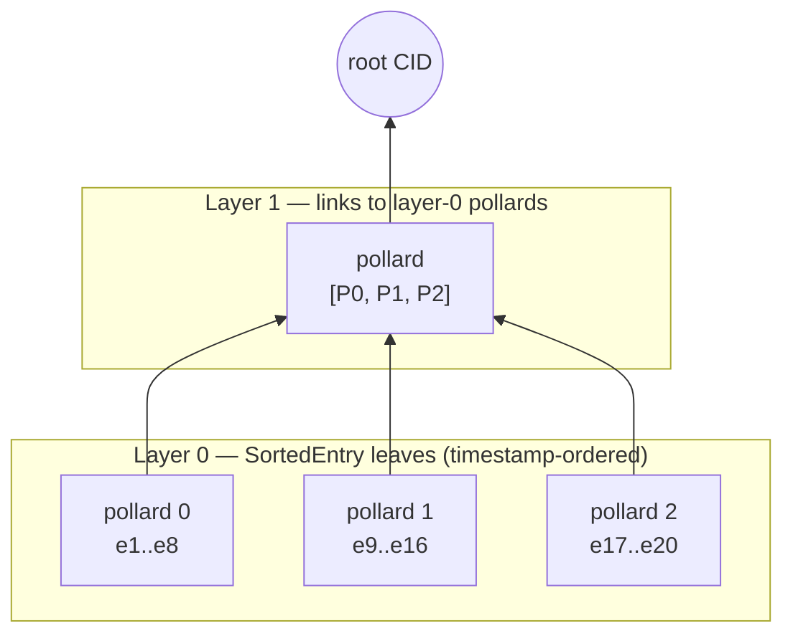
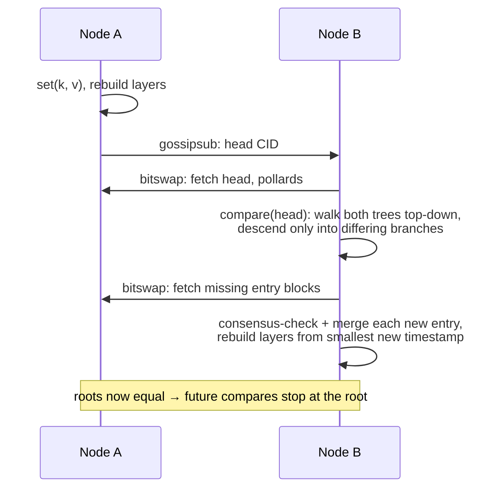

# DenkMitDB Architecture

DenkMitDB is a distributed key-value database built on [IPFS](https://ipfs.tech/)
(via [Helia](https://github.com/ipfs/helia)) and [libp2p](https://libp2p.io/). Every
piece of state — entries, indexes, manifests, identities — is an immutable,
content-addressed, signed block. Replicas converge by exchanging a single CID (the
"head") over gossipsub and diffing Merkle trees to find what they are missing.

## The big picture


## Data model

Every persisted object is a **dag-cbor** block wrapped in a **flattened JWS**
(signed with the writer's identity key, `kid` = identity CID). The building blocks:

| Object | File | Contents | Role |
|---|---|---|---|
| **Identity** | `src/functions/identity.ts` | name, key type, algorithm (default ES384), public key (JWK, base64) | Self-certifying signer identity. Stored as a self-signed JWS (embedded JWK); its CID is the identity's address. The private key lives only in the local datastore, encrypted with a passphrase (PBES2). |
| **Entry** | `src/functions/entry.ts` | version, timestamp (`Date.now()` ms), key, value | One write. Immutable; an update to a key is a brand-new entry. |
| **Pollard** | `src/functions/polllard/pollard.ts` | version, order, leaves + hash layers | A fixed-capacity Merkle subtree with `2^order` leaves (order is set in the manifest, default 3 → 8 leaves). The database's full tree is built from many pollards stacked in layers. |
| **Leaf** | `src/functions/polllard/leaf.ts` | type + payload | Tree node payload. Types: `Empty`, `Hash`, `Pollard` (link to child pollard), `Entry`, `Identity`, `SortedEntry` (entry CID + sort key + db key + creator). |
| **Head** | `src/functions/head.ts` | manifest CID, tree root CID, timestamp, layer count, size | A snapshot pointer: "my database state is the tree rooted at X". This is the only thing peers broadcast. |
| **Manifest** | `src/functions/manifest.ts` | name, type, pollard order, consensus CID, access CID, creation timestamp | The database descriptor. **Its CID is the database address.** Immutable — changing any field creates a different database. |
| **Consensus** | `src/functions/consensus.ts` | name, description, [json-logic](https://jsonlogic.com/) rule | A write-validation predicate evaluated locally against entry metadata (timestamps, creators) on every `set` and every merged remote entry. |

### In-memory state (not persisted)

- **`SortedItemsStore`** (`src/functions/utils/sortedItems.ts`) — the canonical index:
  an ordered map keyed by entry timestamp plus a key→record map. Determines
  iteration order and feeds tree building.
- **Pollard layers** (`DenkmitDatabase.layers`) — layer 0 holds pollards whose leaves
  are `SortedEntry` records; each higher layer holds pollards whose leaves link to the
  pollards below; the top layer has a single pollard, whose CID is the **root**.
- **Keyv cache** — key→value cache so `get` doesn't refetch entry blocks.

All three are rebuilt from IPFS on open/load; losing them is not data loss, but see
[KNOWN_ISSUES.md](KNOWN_ISSUES.md) — `close()` currently discards them and there is no
local persistence of the head, so a restarted node must be re-synced by a peer.

## The Merkle tree ("pollard forest")

Entries are sorted by timestamp and packed into layer-0 pollards, 2^order at a time.
Layer 1 packs the CIDs of layer-0 pollards, and so on, until one pollard remains:



Because entries are timestamp-sorted, an insert at timestamp *t* only invalidates the
pollard containing *t* and everything to its right (`updateLayers` starts rebuilding
from the affected pollard, not from scratch), plus the spine above. Two replicas with
the same entry set always produce the same root CID, regardless of the order in which
they learned the entries — this is what makes head comparison meaningful.

## Write path (`db.set`)

1. Create and sign an `Entry` block; add + pin it in the blockstore.
2. Run the consensus rule against `{currentTimestamp, databaseCreator, currentIdentity, entryTimestamp, entryCreator}`; reject the write if it fails.
3. Insert `(timestamp → key, entryCID, creator)` into `SortedItemsStore` and the value into the Keyv cache.
4. Enqueue a `updateLayers(timestamp)` task on the single-concurrency sync queue (tree building is asynchronous — readers see the entry immediately, the tree catches up).

## Read path (`db.get`)

1. Return the Keyv-cached value if present.
2. Otherwise look the key up in `SortedItemsStore`, fetch the entry block by CID
   (bitswap fetches from peers transparently if it isn't local), verify its signature,
   cache and return the value.

## Sync protocol

The pubsub topic is the manifest **name** (see [KNOWN_ISSUES.md](KNOWN_ISSUES.md) — it
should be the manifest CID). Every 30 s (and on demand via `sendHead()`), a node
publishes the CID of its current head if the root changed.



`compare` walks the two trees in lockstep from the root. Equal node hashes prune the
whole branch; only differing leaves are returned. Cost is O(diff · order), not
O(database size) — this is the core idea of the design.

`merge` consensus-checks each incoming `SortedEntry`, inserts it into the index, and
rebuilds layers once from the smallest merged timestamp. A node whose database is
empty takes the `load` path instead: it walks the remote tree and ingests every leaf.

## Trust model

- **Authentication**: every block is a JWS; `kid` is the CID of the writer's identity,
  which is itself a self-signed, content-addressed block. Verification fetches the
  identity (over bitswap if needed) and checks the signature. Nothing can be forged
  without a private key; tampering changes CIDs.
- **Authorization**: *currently none* — the default consensus rule is the constant
  `true` and the manifest's `access` field is a placeholder. Any peer that knows the
  database address can write. This is the top item in [ROADMAP.md](ROADMAP.md).
- **Conflict resolution**: intended to be last-write-wins by entry timestamp; the
  current implementation deviates from this in important ways
  ([KNOWN_ISSUES.md](KNOWN_ISSUES.md) #2, #3).

## Source layout

```
src/
├── functions/            # implementation (published API surface)
│   ├── denkmitdb.ts      # DenkmitDatabase: set/get/iterate, tree building, merge
│   ├── entry.ts          # signed key-value write records
│   ├── identity.ts       # key generation, JWS sign/verify, JWE encrypt/decrypt
│   ├── manifest.ts       # database descriptor (the address)
│   ├── head.ts           # replication snapshot pointer
│   ├── consensus.ts      # json-logic write-validation controller
│   ├── sync.ts           # pubsub subscription + serialized task queue
│   ├── polllard/         # [sic] Merkle subtree + leaf codecs
│   └── utils/
│       ├── helia.ts      # HeliaStorage/HeliaController: dag-cbor + JWS plumbing
│       └── sortedItems.ts# timestamp-ordered in-memory index
└── types/                # public interfaces & constants, mirrored per module
test/                     # vitest suites; *.integration.* spin up real libp2p nodes
```

## Design notes & trade-offs

- **Why timestamps as sort keys?** They give a total order that every replica agrees
  on without coordination, which makes tree construction deterministic. The price is
  wall-clock trust: skewed clocks reorder history, and same-millisecond writes collide.
  Phase 2 of the roadmap replaces the raw timestamp with a composite key
  `[timestamp, entryCID]` (and eventually a hybrid logical clock).
- **Why pollards instead of one big Merkle tree?** Fixed-size subtrees are natural
  storage/transfer units: a diff transfers only the pollards on the changed spine, and
  append-heavy workloads only rewrite the rightmost pollard per layer.
- **Why is the tree built asynchronously?** Signing and hashing on every `set` would
  serialize writes. The queue batches tree rebuilds; the index and cache are always
  current, and the head simply lags by at most one queue drain.
