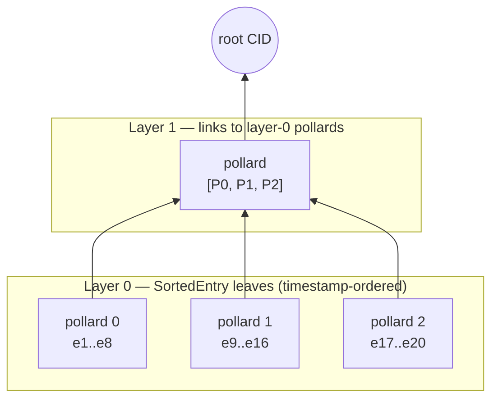
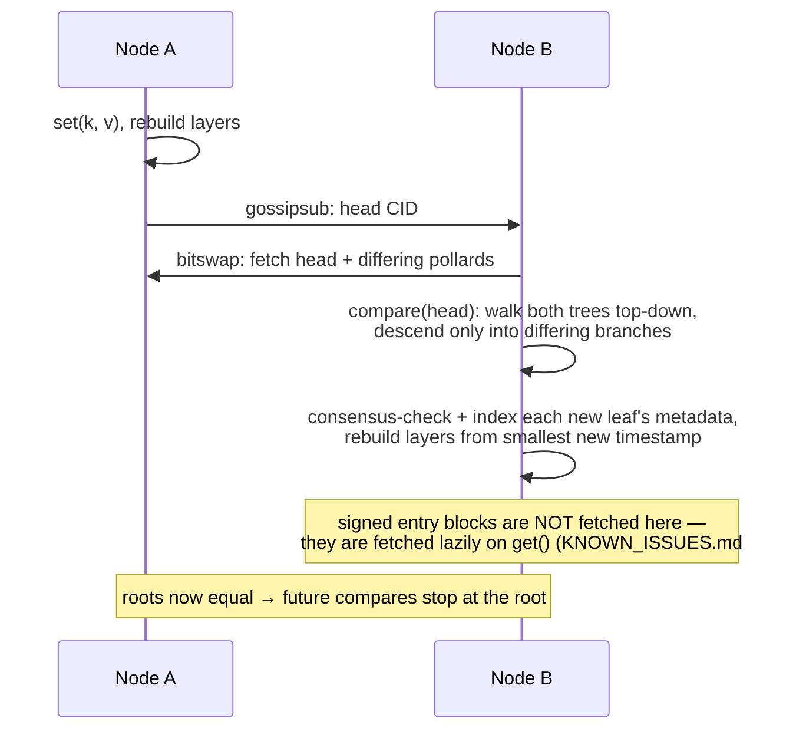

# DenkMitDB Architecture

DenkMitDB is a distributed key-value database built on [IPFS](https://ipfs.tech/)
(via [Helia](https://github.com/ipfs/helia)) and [libp2p](https://libp2p.io/). All
state lives in immutable, content-addressed dag-cbor blocks. Entries, heads,
manifests, consensus rules and identities are additionally **signed** (JWS);
pollards — the Merkle index nodes — are **not** (see the trust model below).
Replicas converge by exchanging a single CID (the "head") over gossipsub and
diffing Merkle trees to find what they are missing.

## The big picture


## Data model

Persisted objects are **dag-cbor** blocks. Entries, heads, manifests and consensus
rules are wrapped in a **flattened JWS** (signed with the writer's identity key,
`kid` = identity CID); identities are self-signed with an embedded JWK; **pollards
are stored unsigned** — their integrity comes from content addressing only. The
building blocks:

| Object | File | Contents | Role |
|---|---|---|---|
| **Identity** | `src/functions/identity.ts` | name, key type, algorithm (default ES384), public key (JWK, base64) | Self-certifying signer identity. Stored as a self-signed JWS (embedded JWK); its CID is the identity's address. The private key lives only in the local datastore, encrypted with a passphrase (PBES2). |
| **Entry** | `src/functions/entry.ts` | version, timestamp (`Date.now()` ms), key, value | One write. Immutable; an update to a key is a brand-new entry. |
| **Pollard** | `src/functions/polllard/pollard.ts` | version, order, leaves + hash layers | A fixed-capacity Merkle subtree with `2^order` leaves (order is recorded in the manifest; currently hardcoded to 3 → 8 leaves — the `order` option exists but is ignored, KNOWN_ISSUES.md #19). Stored **unsigned**. The database's full tree is built from many pollards stacked in layers. |
| **Leaf** | `src/functions/polllard/leaf.ts` | type + payload | Tree node payload. Types: `Empty`, `Hash`, `Pollard` (link to child pollard), `Entry`, `Identity`, `SortedEntry` (entry CID + sort key + db key + creator). |
| **Head** | `src/functions/head.ts` | manifest CID, tree root CID, timestamp, layer count, size | A snapshot pointer: "my database state is the tree rooted at X". This is the only thing peers broadcast. |
| **Manifest** | `src/functions/manifest.ts` | name, type, pollard order, consensus CID, access CID, creation timestamp | The database descriptor. **Its CID is the database address.** Immutable — changing any field creates a different database. |
| **Consensus** | `src/functions/consensus.ts` | name, description, [json-logic](https://jsonlogic.com/) rule | A write-validation predicate evaluated locally against entry metadata (timestamps, creators) on every `set` and every merged remote entry. |

### In-memory state (not persisted)

- **`SortedItemsStore`** (`src/functions/utils/sortedItems.ts`) — the working index:
  an ordered map keyed by entry timestamp plus a key→record map. Determines
  iteration order and feeds tree building. (It is *intended* to be canonical;
  KNOWN_ISSUES.md #2/#3 describe states where its two internal maps disagree.)
- **Pollard layers** (`DenkmitDatabase.layers`) — layer 0 holds pollards whose leaves
  are `SortedEntry` records; each higher layer holds pollards whose leaves link to the
  pollards below; the top layer has a single pollard, whose CID is the **root**.
- **Keyv cache** — key→value cache so `get` doesn't refetch entry blocks. By default
  in-memory, but callers may supply their own (possibly persistent) Keyv — note that
  `close()` currently `clear()`s it even when caller-owned (KNOWN_ISSUES.md D4).

None of this is persisted locally by the database itself. `openDenkmitDatabase()`
fetches only the manifest and consensus rule — the index and layers stay empty until
a peer announces a head (then `load()` rebuilds index + layers; the value cache
fills lazily on `get()`). See KNOWN_ISSUES.md D4.

## The Merkle tree ("pollard forest")

Entries are sorted by timestamp and packed into layer-0 pollards, 2^order at a time.
Layer 1 packs the CIDs of layer-0 pollards, and so on, until one pollard remains:



Because entries are timestamp-sorted, an insert at timestamp *t* only invalidates the
pollard containing *t* and everything to its right (`updateLayers` starts rebuilding
from the affected pollard, not from scratch), plus the spine above.

The *design goal* is that two replicas holding the same entry set produce the same
root CID regardless of the order in which they learned the entries — that is what
makes head comparison meaningful. The current implementation does not fully deliver
this: same-millisecond writes collide by insertion order (KNOWN_ISSUES.md #3), per-key
conflict resolution is merge-order-dependent (#2), and tree comparison ignores
`SortedEntry` metadata (#12). Fixing those — with a composite `[timestamp, entryCID]`
sort key — is what makes the guarantee real.

## Write path (`db.set`)

1. Create and sign an `Entry` block; add + pin it in the blockstore.
2. Run the consensus rule against `{currentTimestamp, databaseCreator, currentIdentity, entryTimestamp, entryCreator}`; reject the write if it fails.
3. Insert `(timestamp → key, entryCID, creator)` into `SortedItemsStore` and the value into the Keyv cache.
4. Enqueue a `updateLayers(timestamp)` task on the single-concurrency sync queue (tree building is asynchronous — readers see the entry immediately, the tree catches up).

## Read path (`db.get`)

1. Return the Keyv-cached value if present.
2. Otherwise look the key up in `SortedItemsStore`, fetch the entry block by CID
   (bitswap fetches from peers transparently if it isn't local), verify its signature,
   cache and return the value.

## Sync protocol

The pubsub topic is the manifest **name** (see [KNOWN_ISSUES.md](KNOWN_ISSUES.md) — it
should be the manifest CID). Every 30 s (and on demand via `sendHead()`), a node
publishes the CID of its current head if the root changed.



`compare` walks the two trees in lockstep from the root. Equal node hashes prune the
whole branch; only differing leaves are returned. Within one pollard the work is
O(diff · order); a full database comparison additionally descends the differing
spine of the layer tree and fetches each differing pollard block over the network,
so the realistic bound is O(diff · order · tree-height) plus those block fetches —
still independent of total database size, which is the core idea of the design.

`merge` consensus-checks each incoming `SortedEntry` **using the leaf's own
metadata** — the signed entry is not fetched or verified at merge time; that
happens lazily when the value is first read. This is the trust gap tracked as
KNOWN_ISSUES.md #10. Merge inserts the leaf into the index and rebuilds layers once
from the smallest merged timestamp. A node whose database is empty takes the `load`
path instead: it walks the remote tree and ingests every leaf.

## Trust model

- **Authentication — entries, heads, manifests, consensus rules**: these blocks are
  JWS-signed; `kid` is the CID of the writer's identity, itself a self-signed,
  content-addressed block. Verification fetches the identity (over bitswap if
  needed) and checks the signature. Tampering with any *fetched-and-verified* block
  is detectable.
- **Authentication — the index is currently NOT covered**: pollards are unsigned,
  and merge indexes leaf metadata (`key`, timestamp, creator) without fetching the
  signed entry to cross-check it. Content addressing guarantees you got the bytes
  the *sender* meant — not that those bytes tell the truth. A malicious peer can
  therefore forge index metadata wholesale (KNOWN_ISSUES.md #10), and heads are not
  even checked to belong to this database (#11). Closing this gap — verify entries
  at merge time, bind heads to the manifest — is the first correctness item in
  [ROADMAP.md](ROADMAP.md).
- **Authorization**: *currently none* — the default consensus rule is the constant
  `true` and the manifest's `access` field is a placeholder. Any peer that knows the
  database address can write (KNOWN_ISSUES.md D1).
- **Conflict resolution**: intended to be last-write-wins by entry timestamp; the
  current implementation deviates from this in important ways
  ([KNOWN_ISSUES.md](KNOWN_ISSUES.md) #2, #3).

## Source layout

```
src/
├── functions/            # implementation (published API surface)
│   ├── denkmitdb.ts      # DenkmitDatabase: set/get/iterate, tree building, merge
│   ├── entry.ts          # signed key-value write records
│   ├── identity.ts       # key generation, JWS sign/verify, JWE encrypt/decrypt
│   ├── manifest.ts       # database descriptor (the address)
│   ├── head.ts           # replication snapshot pointer
│   ├── consensus.ts      # json-logic write-validation controller
│   ├── sync.ts           # pubsub subscription + serialized task queue
│   ├── polllard/         # [sic] Merkle subtree + leaf codecs
│   └── utils/
│       ├── helia.ts      # HeliaStorage/HeliaController: dag-cbor + JWS plumbing
│       └── sortedItems.ts# timestamp-ordered in-memory index
└── types/                # public interfaces & constants, mirrored per module
test/                     # vitest suites; *.integration.* spin up real libp2p nodes
```

## Design notes & trade-offs

- **Why timestamps as sort keys?** They give a total order that every replica agrees
  on without coordination, which makes tree construction deterministic. The price is
  wall-clock trust: skewed clocks reorder history, and same-millisecond writes collide.
  Phase 2 of the roadmap replaces the raw timestamp with a composite key
  `[timestamp, entryCID]` (and eventually a hybrid logical clock).
- **Why pollards instead of one big Merkle tree?** Fixed-size subtrees are natural
  storage/transfer units: a diff transfers only the pollards on the changed spine, and
  append-heavy workloads only rewrite the rightmost pollard per layer.
- **Why is the tree built asynchronously?** Hashing the tree spine on every `set`
  would serialize writes. Instead each write enqueues a rebuild on a
  single-concurrency queue: the index and cache are updated synchronously, the tree
  catches up. Note the queue *serializes*, it does not coalesce — under sustained
  writes the head lags by the whole backlog, and because queue promises are
  currently detached (KNOWN_ISSUES.md #14), `set()` resolving does not mean the
  tree is current.
