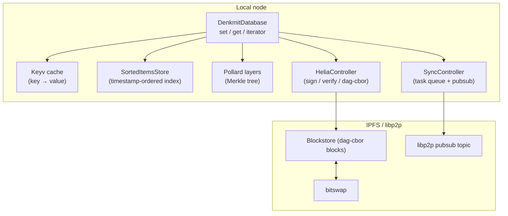
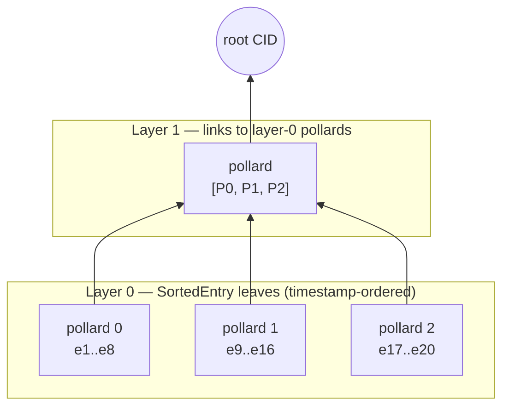

# DenkMitDB Architecture

DenkMitDB is a distributed key-value database built on [IPFS](https://ipfs.tech/)
(via [Helia](https://github.com/ipfs/helia)) and [libp2p](https://libp2p.io/). All
state lives in immutable, content-addressed dag-cbor blocks. Entries, heads,
manifests, consensus rules and identities are additionally **signed** (JWS);
pollards — the Merkle index nodes — are **not** (see the trust model below).
Replicas converge by exchanging a single CID (the "head") over libp2p pubsub and
diffing Merkle trees to find what they are missing.

## The big picture



## Data model

Persisted objects are **dag-cbor** blocks. Entries, heads, manifests and consensus
rules are wrapped in a **flattened JWS** (signed with the writer's identity key,
`kid` = identity CID); identities are self-signed with an embedded JWK; **pollards
are stored unsigned** — their integrity comes from content addressing only. The
building blocks:

| Object | File | Contents | Role |
|---|---|---|---|
| **Identity** | `src/functions/identity.ts` | name, key type, algorithm (default ES384), public key (JWK, base64) | Self-certifying signer identity. Stored as a self-signed JWS (embedded JWK); its CID is the identity's address. The private key lives only in the local datastore, encrypted with a passphrase (PBES2). |
| **Entry** | `src/functions/entry.ts` | version, timestamp (`Date.now()` ms), key, value | One write. Immutable; an update to a key is a brand-new entry. |
| **Pollard** | `src/functions/pollard/pollard.ts` | version, order, leaves + hash layers | A fixed-capacity Merkle subtree with `2^order` leaves (order is recorded in the manifest; currently hardcoded to 3 → 8 leaves — the `order` option exists but is ignored, KNOWN_ISSUES.md #19). Stored **unsigned**. The database's full tree is built from many pollards stacked in layers. |
| **Leaf** | `src/functions/pollard/leaf.ts` | type + payload | Tree node payload. Types: `Empty`, `Hash`, `Pollard` (link to child pollard), `Entry`, `Identity`, `SortedEntry` (entry CID + sort key + db key + creator). |
| **Head** | `src/functions/head.ts` | manifest CID, tree root CID, timestamp, layer count, size | A snapshot pointer: "my database state is the tree rooted at X". This is the only thing peers broadcast. |
| **Manifest** | `src/functions/manifest.ts` | name, type, pollard order, consensus CID, access CID, creation timestamp | The database descriptor. **Its CID is the database address.** Immutable — changing any field creates a different database. |
| **Policy** | `src/functions/policy.ts` | name, description, [json-logic](https://jsonlogic.com/) rule | A write-validation predicate evaluated locally against entry metadata (timestamps, creators) on every `set` and every merged remote entry. |

### In-memory state (not persisted)

- **`SortedItemsStore`** (`src/functions/utils/sortedItems.ts`) — the canonical
  index: an ordered map keyed by the composite key `(timestamp, entry CID)` plus a
  key→record map holding the last-write-wins winner for each key. Determines
  iteration order and feeds tree building.
- **Pollard layers** (`DenkmitDatabase.layers`) — layer 0 holds pollards whose leaves
  are `SortedEntry` records; each higher layer holds pollards whose leaves link to the
  pollards below; the top layer has a single pollard, whose CID is the **root**.
- **Keyv cache** — key→value cache so `get` doesn't refetch entry blocks. By default
  in-memory, but callers may supply their own (possibly persistent) Keyv — note that
  `close()` currently `clear()`s it even when caller-owned (KNOWN_ISSUES.md D4).

None of this is persisted locally by the database itself. `openDenkmitDatabase()`
fetches only the manifest and consensus rule — the index and layers stay empty until
a peer announces a head (then `load()` rebuilds index + layers; the value cache
fills lazily on `get()`). See KNOWN_ISSUES.md D4.

## The Merkle tree ("pollard forest")

Entries are sorted by timestamp and packed into layer-0 pollards, 2^order at a time.
Layer 1 packs the CIDs of layer-0 pollards, and so on, until one pollard remains:



Because entries are timestamp-sorted, an insert at timestamp *t* only invalidates the
pollard containing *t* and everything to its right (`updateLayers` starts rebuilding
from the affected pollard, not from scratch), plus the spine above.

Two replicas holding the same entry set produce the same root CID regardless of the
order in which they learned the entries — that is what makes head comparison
meaningful. This holds because entries are ordered by the composite key
`(timestamp, entryCID)` (`specs/ordering.md`): a total order with no collisions,
per-key last-write-wins that is independent of merge order, and full-metadata leaf
equality so the diff can't hide a difference.

## Write path (`db.set`)

1. Create and sign an `Entry` block; add + pin it in the blockstore.
2. Run the consensus rule against `{currentTimestamp, databaseCreator, currentIdentity, entryTimestamp, entryCreator}`; reject the write if it fails.
3. Insert `(timestamp → key, entryCID, creator)` into `SortedItemsStore` and the value into the Keyv cache.
4. Enqueue a `updateLayers(timestamp)` task on the single-concurrency sync queue (tree building is asynchronous — readers see the entry immediately, the tree catches up).

## Read path (`db.get`)

1. Return the Keyv-cached value if present.
2. Otherwise look the key up in `SortedItemsStore`, fetch the entry block by CID
   (bitswap fetches from peers transparently if it isn't local), verify its signature,
   cache and return the value.

## Sync protocol

The pubsub topic is the manifest **name** (see [KNOWN_ISSUES.md](KNOWN_ISSUES.md) — it
should be the manifest CID). Every 30 s (and on demand via `sendHead()`), a node
publishes the CID of its current head if the root changed.

```mermaid
sequenceDiagram
    participant A as Node A
    participant B as Node B
    A->>A: set(k, v), rebuild layers
    A->>B: pubsub: head CID
    B->>A: bitswap: fetch head + differing pollards
    B->>B: compare(head): walk both trees top-down,<br/>descend only into differing branches
    B->>A: bitswap: fetch each differing entry block
    B->>B: verify signature, index the SIGNED key/timestamp/creator,<br/>rebuild layers from the earliest change
    Note over B: leaf metadata is untrusted; a leaf whose entry fails<br/>verification or whose claims are forged is ignored
    Note over A,B: roots now equal → future compares stop at the root
```

`compare` walks the two trees in lockstep from the root. Equal node hashes prune the
whole branch; only differing leaves are returned. Within one pollard the work is
O(diff · order); a full database comparison additionally descends the differing
spine of the layer tree and fetches each differing pollard block over the network,
so the realistic bound is O(diff · order · tree-height) plus those block fetches —
still independent of total database size, which is the core idea of the design.

`merge` fetches and **signature-verifies** each incoming `SortedEntry`'s entry
block, then indexes the *signed* key/timestamp/creator — the leaf's own claims are
untrusted (pollards are unsigned) and are never used for indexing. A leaf whose
entry is missing, fails verification, or is rejected by the consensus rule is
skipped. Records are resolved by last-write-wins on the composite key, and layers
are rebuilt once from the earliest change. A node whose database is empty takes the
`load` path: it walks the remote tree, authenticates every entry the same way, then
rebuilds its own honest tree from the verified index.

## Trust model

- **Authentication — entries, heads, manifests, consensus rules**: these blocks are
  JWS-signed; `kid` is the CID of the writer's identity, itself a self-signed,
  content-addressed block. Verification fetches the identity (over bitswap if
  needed) and checks the signature. Tampering with any *fetched-and-verified* block
  is detectable.
- **Authentication — the index is covered too**: pollards are unsigned, but merge
  never trusts them. Every incoming leaf's entry block is fetched and its signature
  verified, and indexing uses the *signed* key/timestamp/creator, not the leaf's
  claims. Forged leaf metadata is ignored, and heads are accepted only when bound to
  this database's manifest and format version (KNOWN_ISSUES.md #10, #11). Content
  addressing guarantees you got the bytes the sender meant; the signature check adds
  that an honest identity actually authored them.
- **Authorization**: the manifest's `access` field holds a deterministic json-logic
  policy, evaluated (using only the signed entry's creator vs. the manifest creator)
  on both `set` and merge/load. The default is **creator-only** — only the database
  creator may write; `publicWrite: true` opts into world-writable. Because the rule
  uses only deterministic inputs and is read from the signed manifest, every replica
  reaches the same decision (KNOWN_ISSUES.md D1). Allow-list / dynamic ACLs are
  future work.
- **Conflict resolution**: last-write-wins on the composite key
  `(timestamp, entryCID)` — a deterministic total order with per-key LWW and
  superseded-record removal (`specs/ordering.md`, KNOWN_ISSUES.md #2, #3, fixed in
  Phase 2). The remaining caveat is wall-clock trust: a writer with a fast clock
  wins conflicts for the duration of its skew (D3).

## Source layout

```
src/
├── functions/            # implementation (published API surface)
│   ├── denkmitdb.ts      # DenkmitDatabase: set/get/iterate, tree building, merge
│   ├── entry.ts          # signed key-value write records
│   ├── identity.ts       # key generation, JWS sign/verify, JWE encrypt/decrypt
│   ├── manifest.ts       # database descriptor (the address)
│   ├── head.ts           # replication snapshot pointer
│   ├── policy.ts         # json-logic validation/access policy controllers
│   ├── sync.ts           # pubsub subscription + serialized task queue
│   ├── pollard/          # Merkle subtree + leaf codecs
│   └── utils/
│       ├── helia.ts      # HeliaStorage/HeliaController: dag-cbor + JWS plumbing
│       └── sortedItems.ts# timestamp-ordered in-memory index
└── types/                # public interfaces & constants, mirrored per module
test/                     # vitest suites; *.integration.* spin up real libp2p nodes
```

## Design notes & trade-offs

- **Why timestamps as sort keys?** They give a total order that every replica agrees
  on without coordination, which makes tree construction deterministic. The price is
  wall-clock trust: skewed clocks reorder history, and same-millisecond writes collide.
  Phase 2 of the roadmap replaces the raw timestamp with a composite key
  `[timestamp, entryCID]` (and eventually a hybrid logical clock).
- **Why pollards instead of one big Merkle tree?** Fixed-size subtrees are natural
  storage/transfer units: a diff transfers only the pollards on the changed spine, and
  append-heavy workloads only rewrite the rightmost pollard per layer.
- **Why is the tree built asynchronously?** Hashing the tree spine on every `set`
  would serialize writes. Instead each write updates the index and cache
  synchronously and enqueues the tree rebuild on a single-concurrency queue; `set()`
  returns once the entry is durably indexed, and the head catches up when the queue
  drains (await `queue.onIdle()` to observe it). The queue *serializes*, it does not
  coalesce — under sustained writes the head lags by the backlog. Rebuild failures
  are caught and logged rather than left as unhandled rejections (KNOWN_ISSUES.md
  #14).
